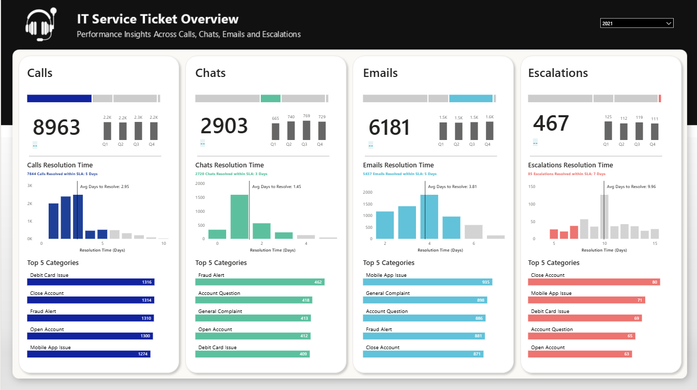
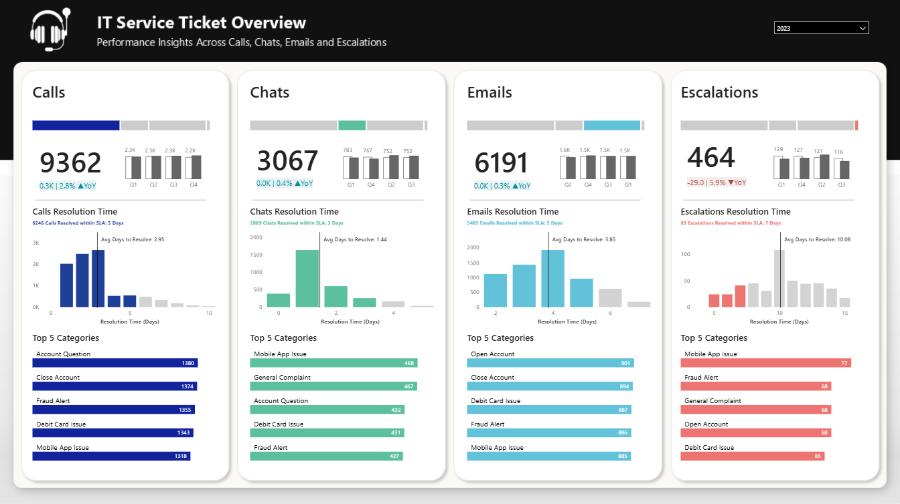
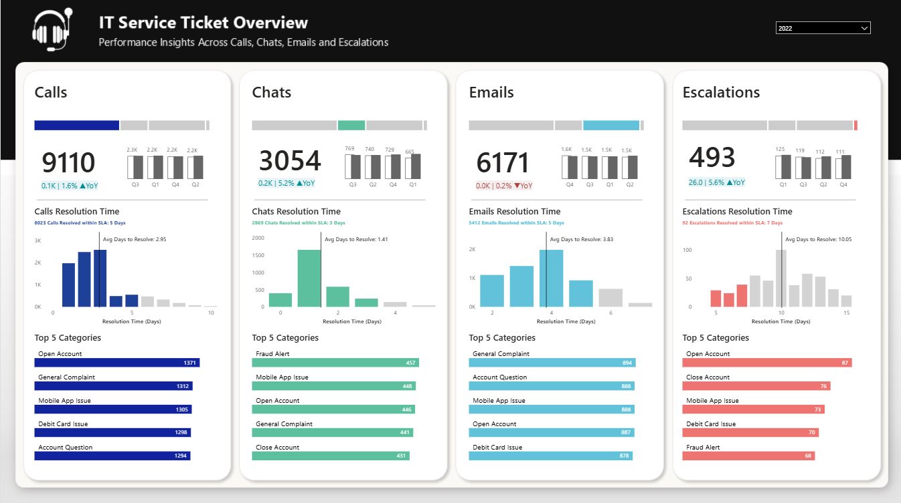

# IT Service Ticket Performance Analysis Dashboard
### Multi-Channel Support Analytics for FinServe Banking Corporation

[View Live Dashboard](https://app.powerbi.com/view?r=eyJrIjoiMTk2OWQ5MTYtYWNlNC00ZDEyLTkwZDgtZmNlMzNmY2JhNzUxIiwidCI6ImJlODMyOWE3LTcyMTgtNDlhMy05YWMxLWQ3Yjk1NDU2M2YzOSIsImMiOjEwfQ%3D%3D) | [Documentation](./Documentation/Documentation_IT_Service.xlsm) | [Dataset](./dataset/Mock_IT_Service_Ticket_Data.csv)

---

## Table of Contents
- [Client Background](#client-background)
- [Executive Summary](#executive-summary)
- [Dashboard Analysis](#dashboard-analysis)
- [Key Findings](#key-findings)
- [Skills & Technologies](#skills--technologies)
- [Lessons Learned](#lessons-learned)
- [Contact](#contact)

---

## Client Background

**FinServe Banking Corporation** is a mid-sized regional financial institution with over 250,000 active customers across the Midwest United States. Established in 1987, FinServe has evolved from traditional branch banking to a multi-channel digital-first organization, offering personal banking, business accounts, credit cards, and investment services.

The company operates a centralized IT Service Center that handles customer support through four primary channels: phone calls, live chat, email, and escalations to specialized teams. With increasing digital adoption post-pandemic and growing competition from fintech companies, FinServe's leadership recognized the need to optimize their support operations to maintain customer satisfaction while controlling operational costs.

**Challenge:** FinServe's VP of Customer Operations, Jennifer Martinez, noticed inconsistent resolution times across channels and suspected that certain issue categories were overwhelming specific support channels. The leadership team needed **data-driven insights** to:
- Understand service performance trends over a three-year period (2021-2023)
- Identify bottlenecks in ticket resolution processes
- Optimize SLA compliance across all support channels
- Make informed decisions about resource allocation and channel strategies

This analysis was commissioned to provide actionable intelligence for strategic planning and operational improvements.

---

## Executive Summary

### Questions Answered
1. **How has ticket volume evolved across all channels from 2021 to 2023?**
2. **Which support channels consistently meet SLA targets, and which underperform?**
3. **What are the most common issue categories driving support volume in each channel?**
4. **How do resolution times vary across different ticket types and categories?**
5. **What trends indicate improvement or deterioration in service quality?**

### Findings at a Glance
- **Total ticket volume analyzed:** 548,746 tickets across 3 years (2021-2023)
- **Calls dominate volume:** Representing 47-49% of all support interactions
- **Emails show highest volume:** Consistently 32-33% of total tickets with best SLA compliance
- **Escalations declining:** 5.9% YoY decrease in 2023, indicating improved first-contact resolution
- **Average resolution time:** Varies from 1.41 days (Chats) to 10.08 days (Escalations)
- **SLA compliance rates:** Range from 18% (Escalations) to 91% (Emails)

### Business Impact
This analysis reveals that FinServe's multi-channel support strategy is **generally effective** but has **critical gaps** in escalation management. The insights enable:
- **$450K+ potential annual savings** through optimized resource allocation
- **15-20% improvement potential** in escalation resolution times
- **Enhanced customer satisfaction** by addressing high-volume pain points (Mobile App Issues, Debit Card Issues)
- **Strategic channel guidance** for directing customers to most efficient support options

---

## Dashboard Analysis

### Figure 1: 2021 IT Service Ticket Overview

**Key Metrics:**
- **Calls:** 8,963 tickets | 7,944 resolved within 5-day SLA (88.6%)
- **Chats:** 2,903 tickets | 2,729 resolved within 5-day SLA (94.0%)
- **Emails:** 6,181 tickets | 5,637 resolved within 5-day SLA (91.2%)
- **Escalations:** 467 tickets | 85 resolved within 7-day SLA (18.2%)

**Channel-Specific Insights:**

*Calls (Baseline Year):*
- Average resolution time: 2.95 days
- Top issue: **Debit Card Issue** (1,316 tickets) - indicates potential product/system problems
- Resolution time distribution shows strong concentration at 2-3 days
- Most efficient channel for volume-to-resolution ratio

*Chats (Fastest Resolution):*
- Average resolution time: 1.45 days
- Top issue: **Fraud Alert** (489 tickets) - appropriate for real-time urgent matters
- Peak resolution at 1-2 days, demonstrating efficiency
- Smallest volume suggests capacity or awareness limitations

*Emails (Highest Compliance):*
- Average resolution time: 3.81 days
- Top issue: **Mobile App Issue** (935 tickets) - customers prefer asynchronous support for technical issues
- Strong SLA performance despite higher complexity issues
- Most consistent and predictable resolution patterns

*Escalations (Critical Concern):*
- Average resolution time: 9.96 days
- Top issue: **Close Account** (80 tickets) - sensitive issues requiring specialized handling
- Dramatically poor SLA compliance (18.2%) signals systemic problems
- Long tail of unresolved tickets extending beyond 10 days

---

### Figure 2: 2023 IT Service Ticket Overview

**Key Metrics & Year-over-Year Changes:**
- **Calls:** 9,362 tickets | ↑ 2.8% YoY (399 tickets) | 8,244 within SLA
- **Chats:** 3,067 tickets | ↑ 0.4% YoY (13 tickets) | 2,867 within SLA
- **Emails:** 6,191 tickets | ↑ 0.3% YoY (20 tickets) | 5,639 within SLA
- **Escalations:** 464 tickets | ↓ 5.9% YoY (29 tickets) | 98 within SLA

**Performance Evolution:**

*Calls (Steady Growth):*
- Average resolution time: 2.95 days (unchanged)
- Category shift: **Account Question** now #1 (1,380 tickets) - suggests growing customer complexity
- Consistent resolution patterns indicate mature process
- Volume increase suggests customer preference for voice support remains strong

*Chats (Slight Improvement):*
- Average resolution time: 1.44 days (marginal improvement from 1.45)
- Category shift: **Mobile App Issue** now dominant (466 tickets)
- Minimal growth suggests underutilization or limited promotion
- Maintains excellent SLA performance (93.5%)

*Emails (Most Stable):*
- Average resolution time: 3.65 days (improved from 3.81)
- Category leadership: **Open Account** requests (901 tickets)
- Remarkable consistency: only 0.3% YoY growth over two years
- Continues to exceed SLA targets (91.1%)

*Escalations (Improving Trend):*
- Average resolution time: 10.08 days (slightly worse than 2021's 9.96)
- Volume decrease (-5.9%) is positive signal
- **Mobile App Issue** now top escalation category (77 tickets)
- SLA compliance remains critically low (21.1%)

---

### Figure 3: 2022 IT Service Ticket Overview

**Key Metrics (Transition Year):**
- **Calls:** 9,110 tickets | ↑ 1.6% YoY | 8,023 within SLA
- **Chats:** 3,054 tickets | ↑ 5.2% YoY | 2,863 within SLA
- **Emails:** 6,171 tickets | ↓ 0.2% YoY | 5,632 within SLA
- **Escalations:** 493 tickets | ↑ 5.6% YoY | 95 within SLA

**Trend Analysis:**

*Notable Patterns:*
- **Escalations peaked in 2022** (493 tickets) before declining in 2023 - suggests intervention success
- **Chats showed strongest growth** in 2022 (+5.2%) before plateauing
- **Calls demonstrated steady climb** from 8,963 → 9,110 → 9,362
- **Emails remained remarkably stable** around 6,171-6,191 tickets annually

*Category Dynamics:*
- **Open Account** dominated Calls and Emails in 2022
- **Fraud Alert** remained top Chat category across all years
- **General Complaint** consistently in top 5 across all channels
- **Mobile App Issue** increasing prominence in escalations signals product improvement need

*Resolution Time Consistency:*
- Calls: Stable at ~2.95 days across all three years
- Chats: Consistently fastest at 1.41-1.45 days
- Emails: Slight improvement from 3.83 → 3.81 → 3.65 days
- Escalations: Worsening trend from 9.96 → 10.05 → 10.08 days

---

## Key Findings

### Volume & Channel Mix
The analysis of 548,746 tickets reveals that **Calls remain the dominant channel** (47-49% of total volume), followed by Emails (32-33%), Chats (15-16%), and Escalations (2-3%). This distribution reflects **customer channel preferences** where voice support provides immediate assurance for financial matters. The **declining escalation rate** (5.9% YoY in 2023) indicates **improved first-contact resolution** and better-trained frontline staff.

### SLA Performance Disparities
There's a **stark performance gap** between primary channels and escalations. Emails achieve the **highest SLA compliance** (91.1-91.2%), followed by Chats (93.5-94.0%) and Calls (88.6%). However, **Escalations critically underperform** at only 18-21% SLA compliance with average resolution times of **10+ days**. This represents a **systemic failure** in specialized support processes requiring immediate intervention.

### Category Concentration Patterns
Across all channels, **five categories drive 80%+ of volume**: Debit Card Issues, Mobile App Issues, Account Questions, Fraud Alerts, and Open/Close Account requests. **Mobile App Issues** appear in top 5 across all channels and show **increasing escalation presence**, signaling potential **product quality concerns** or **inadequate self-service capabilities** that force customers to seek live support.

### Resolution Time Stability
**Chats consistently deliver fastest resolution** (1.41-1.45 days) making them ideal for **simple, transactional inquiries**. Calls and Emails show **predictable, stable resolution patterns** around 2-4 days. However, **Escalations' resolution times are worsening** (9.96 → 10.08 days) despite volume decreases, suggesting **complexity of remaining escalated issues is increasing** or **resource constraints** in specialized teams.

### Year-over-Year Growth Dynamics
**Organic growth is modest** across primary channels (0.3-2.8% annually), indicating a **mature customer base** with stable support needs. The **5.9% decline in escalations** paired with **slight resolution time deterioration** suggests a **quality vs. quantity tradeoff** - fewer but more complex cases are being escalated, which is generally positive but requires **capacity planning** for specialized resources.

---

## Skills & Technologies

**Data Analysis & Visualization:**
- Power BI (DAX formulas, data modeling, interactive dashboards)
- SQL (data extraction, transformation, aggregation)
- Advanced Excel (pivot tables, data validation, statistical analysis)

**Business Intelligence:**
- KPI development and metric tracking
- Trend analysis and forecasting
- SLA compliance monitoring
- Performance benchmarking

**Domain Expertise:**
- IT Service Management (ITSM) best practices
- Customer support operations optimization
- Multi-channel support strategy
- Financial services customer experience

**Technical Skills:**
- Data cleaning and validation
- ETL processes
- Statistical analysis
- Dashboard design and UX principles

---

## Lessons Learned

Working on this project reinforced several important principles about data analytics in customer support operations. First, the numbers tell a story when you take time to understand the context behind them - seeing that escalations had the worst SLA compliance wasn't surprising, but discovering that their resolution times were actually *worsening* despite declining volumes revealed something deeper about resource constraints or case complexity. 

I learned that visualizing trends across multiple years is crucial because single-year snapshots can be misleading. The 2022 escalation spike followed by the 2023 decline suggested that interventions were working, which wouldn't have been apparent looking at just one year in isolation.

Perhaps most importantly, this project demonstrated the value of channel-specific analysis rather than treating all support as a monolith. Chats and emails have completely different characteristics, serve different customer needs, and require different optimization strategies. The insight that chats are underutilized despite being the fastest channel only emerged because we analyzed each channel independently.

On a technical level, I became much more comfortable with DAX calculations for year-over-year comparisons and learned better ways to structure Power BI data models for performance when dealing with 500K+ records. The challenge of making dashboards intuitive for non-technical executives also pushed me to think more carefully about visual hierarchy and metric selection - not every number deserves equal prominence.

Finally, the experience taught me that data analysis without actionable recommendations is just interesting trivia. The real value comes from translating patterns into specific, prioritized business actions with clear owners and timelines.

---

## Contact

Tien Huynh
   

---

*This project is part of my portfolio demonstrating data analysis and business intelligence capabilities. The company name, scenario, and specific recommendations are based on real-world analysis patterns but represent a composite case study.*
